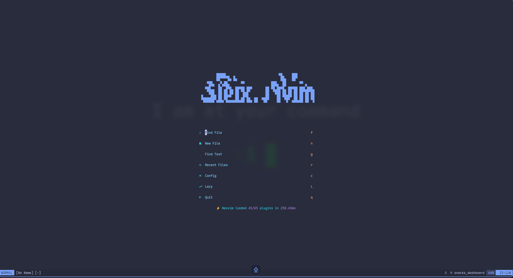

# ⚡ Steix.nvim

A modern, highly optimized Neovim configuration focused on speed, excellent developer experience, and broad language support — with deep tooling for PHP/Laravel, TypeScript, Java, and more.

## Dashboard



## ✨ Features

- **Fast & Reliable:** Powered by `lazy.nvim` for blazing-fast startup times and efficient plugin loading.
- **Aesthetic UI:** Stunning UI with **catppuccin** colors, **bufferline.nvim**, a **lualine.nvim** status line, and a polished command-line via **noice.nvim**.
- **Intelligent Completion:** Blazing-fast completion via **blink.cmp** integrated with LSP, snippets, paths, and buffers.
- **All-in-One Swiss Army Knife:** **snacks.nvim** provides the file explorer, fuzzy finder/picker, terminal, dashboard, indent guides, scroll animations, zen mode, and more.
- **AI-Powered Coding:** GitHub **Copilot** (completion + chat) and **CodeCompanion** (Claude Sonnet adapter) for inline suggestions and AI chat.
- **PHP/Laravel Focus:** Deep Laravel tooling via `adalessa/laravel.nvim`, `larago.nvim`, `phptools.nvim`, `namespace.nvim`, and Blade navigation.
- **Multi-Language LSP:** Configured servers for PHP (Intelephense), TypeScript, Angular, Laravel LS, QML, and Java (via `nvim-java`).
- **Formatting & Diagnostics:** **conform.nvim** (Biome, Stylua, goimports) + **trouble.nvim** for a clean diagnostics panel.
- **Debugging:** Full DAP setup with **nvim-dap** + **nvim-dap-ui** for JS/Node/Chrome debugging.
- **Notes & Docs:** **obsidian.nvim** for note-taking, **markview.nvim** for in-buffer Markdown rendering, and **md-pdf.nvim** for PDF export.

---

## 🚀 Installation

This configuration assumes you have a recent version of **Neovim (0.10.0+)** installed.

### Prerequisites

- Git
- **Neovim (v0.10.0 or later)**
- A **Nerd Font** for proper icon display (Recommended)
- `node` / `npm` (for many LSP servers and DAP adapters)

### Steps

1.  **Backup (Optional):** If you have an existing Neovim configuration, back it up:

    ```bash
    mv ~/.config/nvim{,.bak}
    ```

2.  **Clone the Repository:**

    ```bash
    git clone https://github.com/Eysteix/steix.nvim.git ~/.config/nvim
    ```

3.  **Launch Neovim:**

    ```bash
    nvim
    ```

4.  **Initial Setup:** On the first launch, `lazy.nvim` will automatically install all necessary plugins. If prompted, run `:Lazy install` or `:checkhealth`.

---

## ⚙️ Key Bindings

This configuration uses **which-key.nvim** for an interactive cheat sheet. Press `<leader>` (**Space** by default) to see all available mappings.

### Navigation & Files

| Keymap           | Description                              |
| :--------------- | :--------------------------------------- |
| `<leader><space>`| Smart Find Files (Snacks picker)         |
| `<leader>e`      | Toggle File Explorer (Snacks)            |
| `<leader>,`      | Browse open buffers                      |
| `<leader>/`      | Live grep across project                 |
| `<leader>:`      | Command history                          |
| `<Tab>`          | Next buffer                              |
| `<S-Tab>`        | Previous buffer                          |
| `<leader>bd`     | Delete current buffer                    |
| `<leader>ba`     | Close all buffers except current         |
| `<C-h/j/k/l>`   | Move between windows                     |

### LSP

| Keymap           | Description                              |
| :--------------- | :--------------------------------------- |
| `gd`             | Go to Definition                         |
| `gr`             | References                               |
| `gi`             | Go to Implementation                     |
| `gy`             | Go to Type Definition                    |
| `gai` / `gao`   | Incoming / Outgoing calls                |
| `<leader>ss`     | LSP Symbols                              |
| `<leader>sS`     | Workspace Symbols                        |
| `<leader>fm`     | Format file (LSP)                        |
| `<leader>fa`     | Format buffer (conform.nvim)             |
| `<leader>cR`     | Rename file                              |

### Diagnostics & Code

| Keymap           | Description                              |
| :--------------- | :--------------------------------------- |
| `<leader>xx`     | Diagnostics list (Trouble)               |
| `<leader>xX`     | Buffer diagnostics (Trouble)             |
| `<leader>cs`     | Symbols panel (Trouble)                  |
| `<leader>cl`     | LSP definitions/references (Trouble)     |
| `<leader>xQ`     | Quickfix list (Trouble)                  |
| `zR` / `zM`     | Open / Close all folds (nvim-ufo)        |

### Git

| Keymap           | Description                              |
| :--------------- | :--------------------------------------- |
| `<leader>gg`     | Open Lazygit                             |
| `<leader>gB`     | Git Browse (open in browser)             |

### AI

| Keymap           | Description                              |
| :--------------- | :--------------------------------------- |
| `<C-a>`          | CodeCompanion Actions (n/v)              |
| `<LocalLeader>a` | Toggle CodeCompanion Chat                |
| `ga` (visual)    | Add selection to CodeCompanion Chat      |
| `<leader>cc`     | CopilotChat                              |

### Laravel

| Keymap           | Description                              |
| :--------------- | :--------------------------------------- |
| `<leader>ll`     | Laravel Picker                           |
| `<leader>la`     | Artisan Picker                           |
| `<leader>lr`     | Routes Picker                            |
| `<leader>lm`     | Make Picker                              |
| `<leader>lc`     | Commands Picker                          |
| `<leader>lo`     | Resources Picker                         |
| `<leader>lt`     | Actions Picker                           |
| `<leader>lp`     | Command Center                           |
| `<c-g>`          | View Finder                              |

### UI Toggles

| Keymap           | Description                              |
| :--------------- | :--------------------------------------- |
| `<leader>z`      | Zen Mode                                 |
| `<leader>Z`      | Zoom current window                      |
| `<leader>us`     | Toggle Spelling                          |
| `<leader>uw`     | Toggle Wrap                              |
| `<leader>uL`     | Toggle Relative Numbers                  |
| `<leader>ud`     | Toggle Diagnostics                       |
| `<leader>ul`     | Toggle Line Numbers                      |
| `<leader>uh`     | Toggle Inlay Hints                       |
| `<leader>ug`     | Toggle Indent Guides                     |
| `<leader>uD`     | Toggle Dim                               |
| `<leader>ub`     | Toggle Dark/Light Background             |
| `<leader>uc`     | Toggle Conceal                           |
| `<leader>uT`     | Toggle Treesitter                        |

### Other

| Keymap           | Description                              |
| :--------------- | :--------------------------------------- |
| `<leader>lz`     | Open Lazy plugin manager                 |
| `<leader>ms`     | Open Mason                               |
| `<leader>n`      | Notification history                     |
| `<leader>un`     | Dismiss all notifications                |
| `<leader>.`      | Toggle Scratch Buffer                    |
| `<c-/>`          | Toggle floating terminal                 |
| `]]` / `[[`     | Jump to next / prev word reference       |

---

## 📦 Plugin List

All plugins are managed by **lazy.nvim**.

### Core

| Plugin                       | Description                                           |
| :--------------------------- | :---------------------------------------------------- |
| `folke/lazy.nvim`            | Next-generation plugin manager.                       |
| `nvim-lua/plenary.nvim`      | Essential utility library.                            |
| `folke/which-key.nvim`       | Pop-up with available key bindings.                   |
| `vhyrro/luarocks.nvim`       | LuaRocks package support.                             |

### UI & Aesthetics

| Plugin                            | Description                                         |
| :-------------------------------- | :-------------------------------------------------- |
| `folke/snacks.nvim`               | Dashboard, file explorer, picker, terminal, indent guides, scroll, zen, notifications, and more. |
| `folke/noice.nvim`                | Fully re-designed cmdline, messages, and popupmenu. |
| `rcarriga/nvim-notify`            | Notification backend.                               |
| `akinsho/bufferline.nvim`         | Tab/buffer line.                                    |
| `nvim-lualine/lualine.nvim`       | Status line.                                        |
| `folke/edgy.nvim`                 | Window layout manager.                              |
| `luukvbaal/statuscol.nvim`        | Configurable status column.                         |
| `OXY2DEV/markview.nvim`           | In-buffer Markdown rendering.                       |
| `eero-lehtinen/oklch-color-picker.nvim` | Inline color picker.                          |
| `adelarsq/image_preview.nvim`     | Image preview in Neovim.                            |

### Colorschemes

| Plugin                       | Description                            |
| :--------------------------- | :------------------------------------- |
| `catppuccin/nvim`            | Primary color scheme.                  |
| `folke/tokyonight.nvim`      | Alternative dark theme.                |
| `olimorris/onedarkpro.nvim`  | OneDark-style theme.                   |
| `RRethy/base16-nvim`         | Base16 color scheme collection.        |
| `audibleblink/hackthebox.vim`| HackTheBox-inspired theme.             |

### Icons

| Plugin                       | Description                            |
| :--------------------------- | :------------------------------------- |
| `echasnovski/mini.icons`     | Minimal icon set.                      |
| `nvim-tree/nvim-web-devicons`| File type icons.                       |

### LSP

| Plugin                               | Description                                             |
| :----------------------------------- | :------------------------------------------------------ |
| `neovim/nvim-lspconfig`              | LSP server configurations.                              |
| `mason-org/mason.nvim`               | LSP/DAP/linter installer.                               |
| `mason-org/mason-lspconfig.nvim`     | Bridge between Mason and lspconfig.                     |
| `folke/lazydev.nvim`                 | Lua LSP completions for Neovim development.             |
| `kosayoda/nvim-lightbulb`            | Code action indicator (💡 icon).                        |
| `saecki/live-rename.nvim`            | Inline LSP rename with live preview.                    |

**Configured LSP servers:** `intelephense` (PHP), `laravel_ls`, `ts_ls` (TypeScript/JS), `angularls`, `qmlls` (QML), `jdtls` (Java via `nvim-java`).

### Completion

| Plugin                       | Description                                              |
| :--------------------------- | :------------------------------------------------------- |
| `saghen/blink.cmp`           | Fast, modern completion engine with LSP, snippets, paths, and buffers. |
| `onsails/lspkind.nvim`       | VS Code-style kind icons in the completion menu.         |
| `rafamadriz/friendly-snippets` | Community snippet collection.                          |
| `windwp/nvim-autopairs`      | Auto-close brackets and quotes.                          |

### Formatting & Diagnostics

| Plugin                            | Description                                          |
| :-------------------------------- | :--------------------------------------------------- |
| `stevearc/conform.nvim`           | Formatter (Biome, Stylua, goimports, gofmt, etc.).   |
| `nvimtools/none-ls.nvim`          | Null-ls successor for additional formatters/linters. |
| `folke/trouble.nvim`              | Pretty diagnostics, references, and quickfix list.   |

### Treesitter

| Plugin                       | Description                                         |
| :--------------------------- | :-------------------------------------------------- |
| `nvim-treesitter/nvim-treesitter` | Syntax highlighting, folding, and structural editing. |
| `folke/ts-comments.nvim`     | Correct comment strings per treesitter language.    |

### Navigation & File Management

| Plugin                         | Description                                      |
| :----------------------------- | :----------------------------------------------- |
| `nvim-tree/nvim-tree.lua`      | File tree explorer (also available via `<leader>E`). |
| `ahmedkhalf/project.nvim`      | Project detection and management.                |
| `kevinhwang91/nvim-ufo`        | Modern code folding with treesitter/indent providers. |

### Git

| Plugin                       | Description                              |
| :--------------------------- | :--------------------------------------- |
| `kdheepak/lazygit.nvim`      | Lazygit TUI integration.                 |

### AI

| Plugin                           | Description                                          |
| :-------------------------------- | :--------------------------------------------------- |
| `olimorris/codecompanion.nvim`   | AI coding assistant (Copilot adapter, Claude Sonnet).|
| `CopilotC-Nvim/CopilotChat.nvim` | Copilot Chat in a sidebar.                           |
| `zbirenbaum/copilot.lua`         | GitHub Copilot inline completion.                    |
| `copilotlsp-nvim/copilot-lsp`    | Copilot LSP (NES) support.                           |

### Debugging

| Plugin                       | Description                               |
| :--------------------------- | :---------------------------------------- |
| `mfussenegger/nvim-dap`      | Debug Adapter Protocol client.            |
| `rcarriga/nvim-dap-ui`       | UI for nvim-dap.                          |
| `nvim-neotest/nvim-nio`      | Async I/O library (DAP dependency).       |

### PHP / Laravel

| Plugin                         | Description                                              |
| :----------------------------- | :------------------------------------------------------- |
| `adalessa/laravel.nvim`        | Full Laravel integration: Artisan, routes, views, pickers.|
| `ccaglak/larago.nvim`          | Artisan command shortcuts.                               |
| `ccaglak/namespace.nvim`       | PHP namespace auto-insertion.                            |
| `ccaglak/phptools.nvim`        | Enhanced PHP tooling.                                    |
| `ricardoramirezr/blade-nav.nvim` | Blade template navigation.                             |

### Java

| Plugin               | Description                            |
| :------------------- | :------------------------------------- |
| `nvim-java/nvim-java` | All-in-one Java support (jdtls).      |

### Web Development

| Plugin                           | Description                                      |
| :-------------------------------- | :----------------------------------------------- |
| `barrett-ruth/live-server.nvim`  | Launch a live-reloading browser server.          |
| `barrett-ruth/import-cost.nvim`  | Display import bundle size inline.               |
| `rest-nvim/rest.nvim`            | Execute HTTP requests from `.http` files.        |
| `Shobhit-Nagpal/nvim-rafce`      | React functional component snippet (`rafce`).    |

### Markdown & Notes

| Plugin                       | Description                               |
| :--------------------------- | :---------------------------------------- |
| `obsidian-nvim/obsidian.nvim`| Obsidian-compatible note-taking.          |
| `arminveres/md-pdf.nvim`     | Export Markdown to PDF.                   |

### Editing Utilities

| Plugin                         | Description                                        |
| :----------------------------- | :------------------------------------------------- |
| `kylechui/nvim-surround`       | Add/change/delete surrounding pairs.               |
| `okuuva/auto-save.nvim`        | Automatic buffer saving.                           |
| `ThePrimeagen/refactoring.nvim`| Language-aware refactoring operations.             |
| `folke/sidekick.nvim`          | Inline documentation viewer.                       |

---

## 🤝 Contributing

Contributions are welcome! If you find a bug or have a suggestion, please open an issue or submit a pull request on the [Eysteix/steix.nvim](https://github.com/Eysteix/steix.nvim) repository.

## 📄 License

This configuration is released under the **MIT License**. See the `LICENSE` file for more details.

---
